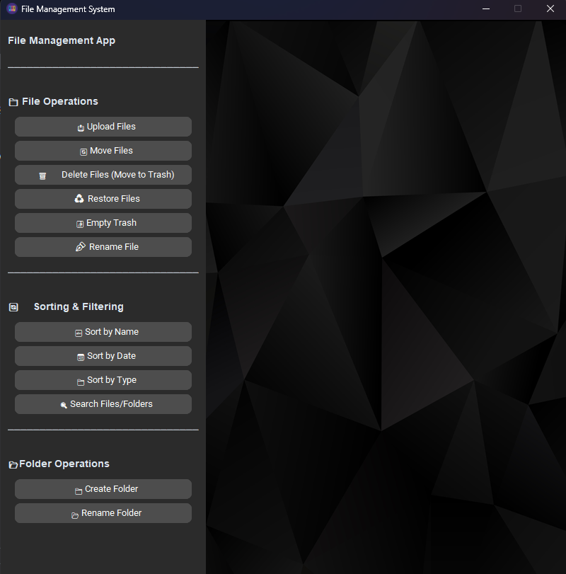

# 🗂️ File Management System

A powerful and intuitive desktop GUI application for managing files and folders on your system. This project is built with **Python**, **CustomTkinter**, and enhanced with features like Trash management, sorting, searching, and file operations—all wrapped in a modern UI.

---

## 📌 Features

- 📤 Upload files for manipulation
- 🔄 Move and rename files or folders
- 🗑️ Delete files (safely moved to Trash or Recycle Bin)
- ♻️ Restore deleted files from Trash
- 🚮 Permanently clear Trash
- 🔍 Search files/folders with a scrollable result viewer
- 📂 Create and rename folders
- 🔤 Sort files by:
  - Name
  - Creation date
  - File type (extension)

---

## ⚙️ Tech Stack

| **Technology**     | **Purpose**                                      |
|--------------------|--------------------------------------------------|
| Python             | Core programming language                        |
| CustomTkinter      | Modern GUI framework based on Tkinter            |
| CTkMessagebox      | Pop-up dialogs with enhanced UI                  |
| Tkinter Dialogs    | File selection and folder browsing               |
| PIL (Pillow)       | Image rendering for background display           |
| winshell (Windows) | Recycle Bin integration                          |
| OS, shutil, sys    | File and directory handling                      |
| subprocess         | Open selected files/folders natively             |

---
## 📸 Screenshots:



---

## 📦 Installation

### 1. Clone the Repository

```bash
git clone https://github.com/KaisoX24/File-Management-System.git
cd File-Management-System
```
### 2. Install Dependencies
It's recommended to use a virtual environment:

```bash
python -m venv venv
venv\Scripts\activate # For MAC: source venv/bin/activate
```
- Install the required packages:
  ```bash
  pip install -r requirements.txt
  
### 3. Run the App
```bash
python app.py
```
---

## 👨‍💻 Author
Developed By Pramit Acharjya
---
## 🪪 License
MIT License — free to use, modify, and distribute.
